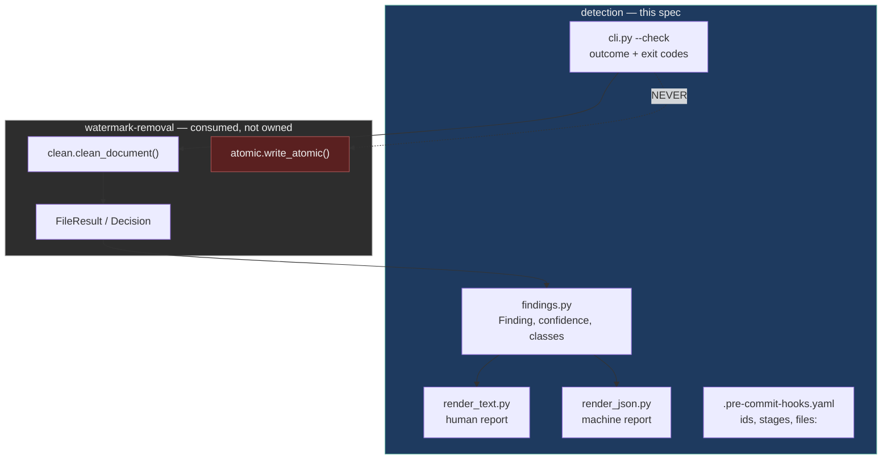
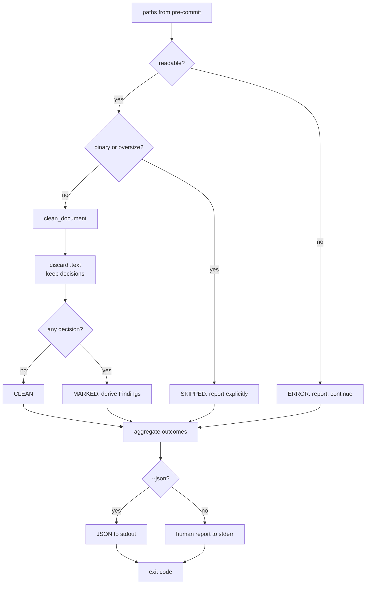

# Design Document — watermark-detection

## Overview

**Purpose**: This feature delivers a read-only gate that can be trusted — one
whose clean result provably means clean, whose findings name the actual
codepoints, and which cannot modify a working tree even by accident.

**Users**: CI owners gating a build, reviewers judging whether a finding is a
true positive, and maintainers of prose repositories for whom the autofix path
is too destructive to enable.

**Impact**: Today `--check` works but is incidental — read-only holds because a
function returns early, coverage misses most text formats, findings are bare
counts, and a skipped file is indistinguishable from a clean one. This design
makes the read-only guarantee **structural**, shares one classifier with
removal so the two cannot disagree, and separates findings from their
presentation.

### Goals

- Detection is incapable of writing, by construction rather than by discipline.
- A clean detection result guarantees a no-op removal run, and vice versa.
- Findings identify codepoint, name, count, position, class and confidence.
- "Skipped" is never reported as "clean".

### Non-Goals

- **What gets removed or preserved.** `watermark-removal` owns every
  classification decision; this spec reports them.
- Layer B statistical watermarks — permanently out of scope, and the reporting
  must say so.
- Remediation advice beyond naming the finding.
- A configuration file or a findings database.

## Boundary Commitments

### This Spec Owns

- The **read-only guarantee** and the code path that enforces it.
- The **`Finding` contract** — codepoint, name, count, offsets, carrier class,
  confidence — and both renderers over it.
- **Outcome taxonomy and exit-code mapping**: `CLEAN`, `MARKED`, `SKIPPED`,
  `ERROR`, plus `--strict`.
- **Hook manifest content**: ids, stages, and the `files:` selection pattern.
- **Scope honesty**: the statement that a clean result covers deterministic
  carriers only.
- The **conformance test** proving detection and removal agree.

### Out of Boundary

- **Classification.** Which characters are carriers, and every preservation
  rule, belong to `watermark-removal`. A detection defect caused by
  misclassification is fixed there, not here.
- **The write path**, file-mode preservation and atomicity.
- **`CleanPolicy` fields and defaults.** This spec reports against the active
  policy; it does not define it.
- **File enumeration.** pre-commit and the shell supply paths.

### Allowed Dependencies

- `watermark-removal`'s `clean_document()`, `FileResult`, `Decision` and
  `CleanPolicy` — consumed, never redefined.
- `_vendor.common.looks_binary` and the size caps, for gating.
- Python standard library only; `json` for structured output.
- **Prohibited**: importing or invoking `atomic.write_atomic`, or any other
  write path, from detection code.
- **Prohibited**: reimplementing any classification rule locally.

### Revalidation Triggers

- **`FileResult` or `Decision` shape changes** — both renderers consume them.
- **A new carrier class or confidence level** — the JSON schema changes for
  consumers.
- **A change to the outcome taxonomy or exit-code mapping** — CI pipelines
  depend on it.
- **A change to the `files:` pattern or hook stages** — alters what adopters
  scan and when.
- **A `CleanPolicy` default change** — alters what a clean result means.

## Architecture

### Existing Architecture Analysis

`clean_one(path, check=True)` computes the cleaned text, compares it to the
input, and returns before writing. Three consequences:

- **Agreement is automatic** — the same code produced both answers. This is the
  one property worth keeping, and this design keeps it.
- **Read-only is incidental** — one edit away from being lost, with no test.
- **Reporting is a by-product** — `removed_count` / `replaced_count` are all
  that survives, because that is all the cleaner needed internally.

### Architecture Pattern & Boundary Map



**Architecture Integration**:

- **Selected pattern**: shared computation, separated presentation. Detection
  calls `clean_document()` and **discards `FileResult.text`**, keeping only the
  decisions.
- **Domain boundaries**: `clean_document` decides, `findings` interprets,
  renderers format, `cli` maps to an exit code. The dashed edge to
  `write_atomic` is the one prohibited call, and it is asserted by test.
- **Existing patterns preserved**: one decision function shared by both paths;
  fail-closed on ambiguity; per-path errors never abort the run.
- **New components rationale**: `findings.py` exists because `FileResult` is
  shaped for cleaning, not for reading — offsets and confidence must be derived.
  Two renderers exist so the formats cannot drift.
- **Steering compliance**: stdlib only; `_vendor/` untouched; the "one decision
  function" invariant is what the whole design turns on.

### Technology Stack

| Layer | Choice / Version | Role in Feature | Notes |
|-------|------------------|-----------------|-------|
| CLI | Python ≥ 3.10, `argparse` | `--check`, `--json`, `--strict` | Extends existing parser |
| Core | `watermark-removal` classifier | Decisions | Consumed, not reimplemented |
| Output | `json` (stdlib) | Machine-readable findings | stdout; diagnostics on stderr |
| Hook integration | pre-commit ≥ 3.2 | Two ids with explicit stages | `stages: [manual]` needs ≥ 3.2 |
| Test | `pytest` (dev-only) | Conformance and read-only proofs | Shared with removal spec |

## File Structure Plan

### Directory Structure

```
src/wm_hook/
├── cli.py              # MODIFIED: --json / --strict, outcome mapping
├── findings.py         # NEW: Finding, carrier class, confidence derivation
├── render_text.py      # NEW: human-readable report
├── render_json.py      # NEW: machine-readable report
└── outcome.py          # NEW: FileStatus enum + exit-code aggregation

tests/
├── test_readonly.py        # no file mutated on any path, including errors
├── test_conformance.py     # detection result agrees with removal, both corpora
├── test_findings.py        # codepoint, offsets, class, confidence correctness
├── test_render_json.py     # schema validity incl. empty and skipped cases
├── test_outcome.py         # exit code per outcome; --strict promotion
└── test_hook_stages.py     # each hook id runs only in its declared stage
```

### Modified Files

- `src/wm_hook/cli.py` — adds `--json` and `--strict`; replaces the
  string-status tuple with `FileStatus`; routes reporting through the renderers.
- `.pre-commit-hooks.yaml` — `files:` widened and made case-insensitive; both
  ids keep explicit `stages:`; each id documents whether it modifies files.
- `pyproject.toml` — no new runtime dependencies; `dev` group shared with the
  removal spec.

## System Flows

### Detection run



Discarding `FileResult.text` at step E is the read-only guarantee: the cleaned
text never reaches a writer because it never leaves the function.

### Exit-code mapping

| Worst outcome in run | Default | `--strict` |
|----------------------|---------|-----------|
| all `CLEAN` | `0` | `0` |
| any `SKIPPED` | `0` | `1` |
| any `MARKED` | `1` | `1` |
| any `ERROR` | `2` | `2` |

`ERROR` dominates `MARKED`, which dominates `SKIPPED`. The default column is
unchanged from today, so adopting this design does not break existing CI.

## Requirements Traceability

| Requirement | Summary | Components | Interfaces | Flows |
|-------------|---------|------------|------------|-------|
| 1.1, 1.2 | No mutation on any path, including errors | `cli` | discard `.text` | detection run |
| 1.3 | Marked file left byte-identical | `cli` | discard `.text` | detection run |
| 1.4 | A hook form that cannot rewrite | manifest | `wm-hook-check` | — |
| 2.1, 2.2 | Detection and removal agree both ways | `cli` | `clean_document` | detection run |
| 2.3 | Concealed marks detected | *(removal: regions)* | `Segmentation` | detection run |
| 2.4 | Full run counts, not one per run | *(removal: classify)* | `prev_base` | detection run |
| 2.5 | Report regardless of neighbours | *(removal: classify)* | `Decision` | detection run |
| 2.6 | Known undetected techniques documented | `render_text`, `render_json` | `scope_note` | detection run |
| 3.1 | Codepoint, name, count | `findings` | `Finding` | detection run |
| 3.2 | At least one offset per finding | `findings` | `Finding.offsets` | detection run |
| 3.3 | Carrier class per finding | `findings` | `CarrierClass` | detection run |
| 3.4 | Confidence per finding | `findings` | `Confidence` | detection run |
| 3.5 | Provenance fields named | `findings` | `Finding.field` | detection run |
| 3.6 | Readable multi-file summary | `render_text` | `render()` | detection run |
| 4.1 | Structured output, full field parity | `render_json` | `render()` | detection run |
| 4.2 | Separate stream from diagnostics | `cli` | stdout vs stderr | detection run |
| 4.3 | Valid output with zero findings | `render_json` | `render()` | detection run |
| 4.4 | Skipped and failed files represented | `render_json` | `FileStatus` | detection run |
| 5.1, 5.2 | Distinct clean and marked statuses | `outcome` | `FileStatus` | exit mapping |
| 5.3 | Unreadable is distinct from both | `outcome` | `FileStatus.ERROR` | exit mapping |
| 5.4 | Skipped never reported as clean | `outcome` | `FileStatus.SKIPPED` | exit mapping |
| 5.5 | `--strict` promotes skipped to failure | `outcome`, `cli` | `--strict` | exit mapping |
| 5.6 | Every problematic file reported | `cli` | aggregation loop | detection run |
| 6.1 | Distinct validation hook id | manifest | `wm-hook-check` | — |
| 6.2, 6.3 | Explicit stages; no cross-stage firing | manifest | `stages:` | — |
| 6.4 | Whole-repo run without mutation | manifest, `cli` | `--all-files` | detection run |
| 6.5 | Manifest documents mutation per id | manifest | `description:` | — |
| 7.1 | Common text formats matched | manifest | `types:` + `files:` | — |
| 7.2 | Case-insensitive extension matching | manifest | `types:` | — |
| 7.3 | Binary matched files skipped and reported | `cli` | `looks_binary` | detection run |
| 7.4 | Extensionless files by explicit path | `cli` | positional paths | detection run |
| 7.5 | Coverage documented | manifest, README | — | — |
| 8.1 | No paths exits successfully | `cli` | `nargs="*"` | detection run |
| 8.2 | Leading-dash path treated as a path | `cli` | `--` separator | detection run |
| 8.3 | Unreadable path does not abort the run | `cli` | aggregation loop | detection run |
| 8.4 | Output encoding covers reported codepoints | `cli` | UTF-8 stdio | detection run |
| 9.1, 9.2 | Clean result qualified; Layer B named | `render_text`, `render_json` | `scope_note` | detection run |
| 9.3 | No unqualified "AI-free" claim | `render_text` | wording | — |
| 9.4 | Limitations discoverable from output | `render_json` | `known_limitations` | detection run |
| 10.1–10.5 | Read-only, conformance, corpora, exit, stage tests | `tests/` | — | — |

Requirements 2.3–2.5 are satisfied by `watermark-removal` components. They are
listed here because detection's *observable* behaviour depends on them; the
implementing work is bounded to that spec, and this spec's conformance test is
what proves the dependency is met.

## Components and Interfaces

| Component | Layer | Intent | Req Coverage | Key Dependencies (P0/P1) | Contracts |
|-----------|-------|--------|--------------|--------------------------|-----------|
| `findings.py` | Core | Turn decisions into readable findings | 3, 9 | `FileResult` (P0) | Service |
| `render_text.py` | Presentation | Human report | 3.6, 9.1–9.3 | `findings` (P0) | Service |
| `render_json.py` | Presentation | Machine report | 4, 9.4 | `findings` (P0) | Service |
| `outcome.py` | Core | Outcome taxonomy and exit mapping | 5 | — | State |
| `cli.py` | Entry | Gating, aggregation, stream routing | 1, 2, 8 | all above (P0), `clean_document` (P0) | Service |
| `.pre-commit-hooks.yaml` | Integration | Hook ids, stages, selection | 6, 7 | — | Batch |

### Core

#### findings.py

| Field | Detail |
|-------|--------|
| Intent | Derive reader-facing findings from cleaning decisions |
| Requirements | 3.1–3.6, 9.1, 9.2 |

**Responsibilities & Constraints**

- Groups decisions by codepoint, counts them, and retains offsets.
- Assigns a **carrier class** and a **confidence** — the two fields that let a
  reader triage. A space homoglyph is `informational`; a zero-width carrier is
  `probable`; a parsed provenance field is `confirmed`.
- Derives everything from `FileResult`. It never re-examines the text, so it
  cannot disagree with the cleaner.

**Dependencies**

- Inbound: `render_text`, `render_json` (P0)
- Outbound: `watermark-removal.FileResult` (P0)

**Contracts**: Service [x]

##### Service Interface

```python
class CarrierClass(Enum):
    ZERO_WIDTH = "zero_width"
    TAG_CHARS = "tag_chars"
    VARIATION_SELECTOR = "variation_selector"
    BIDI = "bidi"
    PRIVATE_USE = "private_use"
    SPACE_HOMOGLYPH = "space"
    OTHER_FORMAT = "other_cf"
    FRONTMATTER = "frontmatter"

class Confidence(Enum):
    CONFIRMED = "confirmed"
    PROBABLE = "probable"
    INFORMATIONAL = "informational"

@dataclass(frozen=True)
class Finding:
    codepoint: int | None      # None for a frontmatter field finding
    label: str                 # "U+200B ZERO WIDTH SPACE (Cf)"
    count: int
    offsets: tuple[int, ...]   # capped; at least one (Req 3.2)
    carrier: CarrierClass
    confidence: Confidence
    field: str | None          # frontmatter key name (Req 3.5)

def findings_for(result: "FileResult") -> tuple[Finding, ...]: ...
```

- **Preconditions**: `result` came from `clean_document` on the same text.
- **Postconditions**: every decision that changed a byte appears in exactly one
  `Finding`; `count` sums to the total decisions; `offsets` is non-empty.
- **Invariants**: pure; no I/O; deterministic ordering (descending count, then
  codepoint) so reports are diffable.

#### outcome.py

| Field | Detail |
|-------|--------|
| Intent | One outcome per file; one exit code per run |
| Requirements | 5.1–5.6 |

**Contracts**: State [x]

```python
class FileStatus(Enum):
    CLEAN = "clean"
    MARKED = "marked"
    SKIPPED = "skipped"
    ERROR = "error"

@dataclass(frozen=True)
class FileOutcome:
    path: Path
    status: FileStatus
    findings: tuple[Finding, ...] = ()
    detail: str | None = None          # skip or error reason

def exit_code(outcomes: Sequence[FileOutcome], *, strict: bool) -> int: ...
```

- **Invariants**: severity ordering `ERROR > MARKED > SKIPPED > CLEAN`; with
  `strict=False` a `SKIPPED` run exits `0`, with `strict=True` it exits `1`.

### Presentation

#### render_json.py

| Field | Detail |
|-------|--------|
| Intent | Stable machine-readable output |
| Requirements | 4.1–4.4, 9.4 |

**Contracts**: API [x]

##### Output Contract

```json
{
  "schema_version": 1,
  "policy": { "normalize_spaces": true, "strip_private_use": false },
  "scope": {
    "layer": "deterministic-carriers-only",
    "excludes": ["statistical-token-sampling-watermarks"],
    "known_limitations": ["..."]
  },
  "summary": { "clean": 12, "marked": 1, "skipped": 2, "error": 0 },
  "files": [
    {
      "path": "docs/notes.md",
      "status": "marked",
      "findings": [
        {
          "codepoint": "U+200B",
          "label": "U+200B ZERO WIDTH SPACE (Cf)",
          "count": 7,
          "offsets": [41, 88, 130],
          "carrier": "zero_width",
          "confidence": "probable",
          "field": null
        }
      ]
    }
  ]
}
```

- Emitted on **stdout**; all diagnostics go to stderr (Requirement 4.2).
- `files` includes skipped and errored entries (Requirement 4.4).
- `scope` is always present, so a consumer cannot read a clean result as an
  absence-of-AI verdict (Requirement 9.1, 9.2, 9.4).

**Implementation Notes**

- *Validation*: `schema_version` is bumped on any breaking field change; the
  bump is a revalidation trigger.

### Integration

#### .pre-commit-hooks.yaml

| Field | Detail |
|-------|--------|
| Intent | Give adopters a gate and an autofix that cannot be confused |
| Requirements | 6.1–6.5, 7.1, 7.2, 7.5 |

**Contracts**: Batch [x]

- **Trigger**: `wm-hook` in `pre-commit`; `wm-hook-check` in `manual`.
- **Selection**: `types: [text]` unioned with `files:` for `.qmd` and `.Rmd`,
  which `identify` does not tag. This covers `.mjs`, `.cjs`, `.html`, `.ipynb`,
  `.po`, `.tf` and extensionless text files, and is case-insensitive — fixing
  Requirements 7.1 and 7.2 together.
- **Idempotency & recovery**: the validation hook is pure; rerunning changes
  nothing.

**Implementation Notes**

- *Risks*: widening selection surfaces many findings at once on first adoption.
  Ship the widened pattern on the validation hook first so adopters get a report
  before an autofix touches anything.
- *Validation*: `pre-commit validate-manifest` in CI, plus a test that runs each
  id in the other's stage and asserts it does not fire.

## Error Handling

### Error Strategy

Per-path, never aborting. Every path yields exactly one `FileOutcome`; the run
exits on the worst.

### Error Categories and Responses

| Category | Trigger | Response | Requirement |
|----------|---------|----------|-------------|
| Unreadable path | `OSError` | `ERROR` with reason; continue | 5.3, 8.3 |
| Binary content | magic / NUL / control density | `SKIPPED` with reason | 5.4, 7.3 |
| Oversize input | above cap | `SKIPPED` with reason | 5.4 |
| Option-like path | leading `-` | Treated as a path | 8.2 |
| No paths supplied | empty argv | Exit `0`, no output | 8.1 |
| Unencodable output | console codec | stdio forced to UTF-8 | 8.4 |

### Monitoring

Human reports to stderr, JSON to stdout, so a CI job can capture one without
the other.

## Testing Strategy

### Unit Tests

- `test_findings.py` — a known payload yields the expected codepoint, count,
  offsets, carrier class and confidence; a frontmatter drop yields a finding
  with `field` set and `codepoint` null.
- `test_outcome.py` — every outcome combination maps to the documented exit
  code; `--strict` promotes `SKIPPED` and nothing else.
- `test_render_json.py` — valid JSON for zero findings, for skipped-only runs,
  and for mixed runs; `scope` always present.

### Integration Tests

- `test_readonly.py` — over both corpora plus induced error cases, assert every
  input file's bytes **and mtime** are unchanged after a detection run. Also
  assert statically that no detection module imports `atomic.write_atomic`.
- `test_conformance.py` — for every corpus file, `detect()` reporting `CLEAN`
  implies `clean_document()` makes no change, and reporting `MARKED` implies it
  does. This is the cross-spec contract test.
- `test_hook_stages.py` — run `pre-commit run --hook-stage manual` against a
  scratch consumer repository and assert the working tree is unchanged; run the
  commit stage and assert only `wm-hook` fires.

### E2E Paths

- A repository with one planted `U+200B` in each of `.mjs`, `.cjs`, `.html`,
  `.ipynb`, `.po`, `.tf`, `.Rmd`, `.qmd`, `README.MD` and `Dockerfile`: the
  validation hook must report **all ten** (Requirement 7.1, 7.2). This is the
  direct regression guard for the eight-of-ten coverage failure.
- `--json` output piped to a parser while the human report is captured
  separately, proving stream separation.

## Security Considerations

- **Read-only under adversarial input.** A crafted file must not induce a write.
  Enforced structurally (the cleaned text is discarded) and by the static
  import assertion in `test_readonly.py`.
- **Argv injection.** A tracked filename beginning with `-` must be a path, not
  an option (Requirement 8.2).
- **Honest reporting.** A clean result must never be presentable as proof that
  text is not model-generated (Requirement 9.3). This is a correctness
  requirement, not a disclaimer: the `scope` object is emitted on every run.
