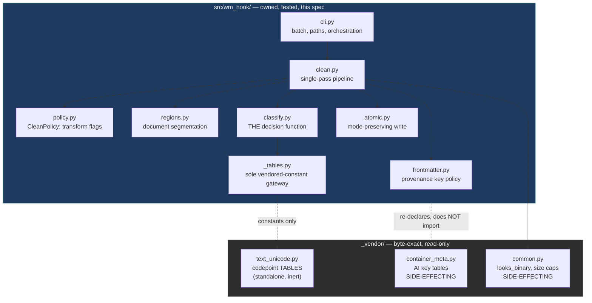
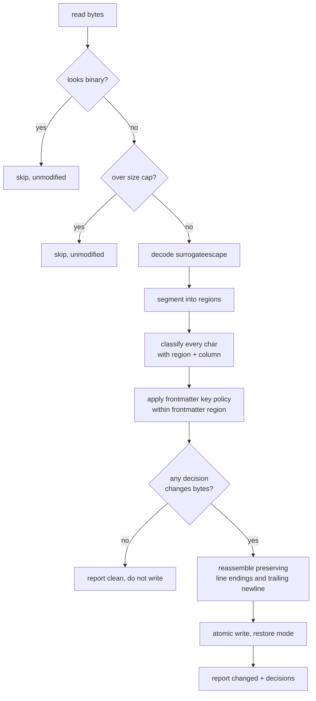
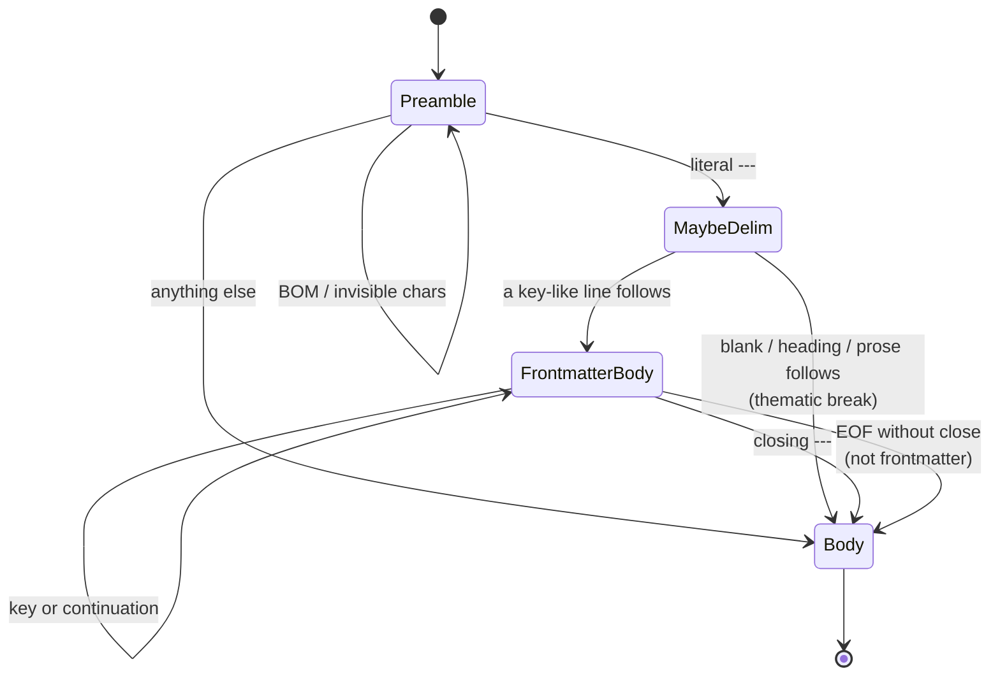

# Design Document — watermark-removal

## Overview

**Purpose**: This feature delivers a rewrite path that can be trusted to run
unattended on every commit — one that converges in a single pass, changes only
the bytes it targets, and never destroys legitimate content that merely
resembles a marker.

**Users**: Developers committing AI-assisted text, and the maintainers who
enable the hook for a whole repository.

**Impact**: Today the rewrite path corrupts YAML, deletes non-Latin word
separators and icon glyphs, churns CRLF files that carry no marks, and drops
the executable bit. This design replaces the position-blind, two-pass pipeline
with a **single position-aware pass over an owned classifier**, while keeping
`_vendor/` byte-exact.

### Goals

- One pass converges: a second run is always a no-op.
- A watermark-free file is left byte-identical, whatever its line endings,
  frontmatter shape, or encoding.
- No transformation may change how a file parses.
- Corrections are reachable, testable, and do not violate the vendoring rule.

### Non-Goals

- Layer B statistical watermarks. Permanently excluded.
- Reporting format, exit codes, hook ids, CI gating — the `watermark-detection`
  spec owns these.
- Container and image formats.
- A configuration file. Requirement 9 needs per-transform flags, not a config
  system.
- Editing `_vendor/`, or blocking on an upstream patch.

## Boundary Commitments

### This Spec Owns

- The **classification decision** for every character: strip, replace, keep —
  and the context rules that choose between them.
- **Region segmentation** of a document: where frontmatter starts and ends, and
  which positions are structurally significant.
- **Frontmatter provenance policy**: which keys are removed and which are
  preserved.
- The **write path**: atomicity, file-mode preservation, symlink refusal,
  binary refusal.
- The **`CleanPolicy`** value object — the set of transforms and their defaults.
- The preservation and convergence **test corpora**.

### Out of Boundary

- **Rendering findings for humans or machines**, exit codes, and hook manifest
  content — owned by `watermark-detection`. This spec produces structured
  decisions; it does not format them.
- **File enumeration.** Paths arrive from pre-commit or the shell.
- **The vendored Unicode inventory.** This spec consumes the tables; it does not
  curate them. New codepoints arrive through `refresh.sh`.
- **Upstreaming corrections.** Desirable, tracked separately, not a dependency.

### Allowed Dependencies

- Python standard library only. No new runtime dependencies (`tech.md`).
- **Constant tables** from `_vendor/text_unicode.py` (`STRIP_CODEPOINTS`,
  `SPACE_HOMOGLYPHS`, `LATIN_CONFUSABLES`, `_ORTHOGRAPHIC_CF`, `_VS_SUPPLEMENT`,
  bidi and script-glue sets) — reached **only** through `_tables.py`. No other
  owned module imports from `_vendor/` directly.
- **Prohibited in production**: importing `_vendor/container_meta.py` or
  `_vendor/common.py`. Both mutate process stdio on import and pull
  `image_meta` with them. The frontmatter key vocabulary is re-declared locally
  and drift-tested instead. Tests may import them.
- **Prohibited**: importing `_decide`, `clean_text`, `clean_markdown`,
  `inspect_text` or `safe_write_*` for production behaviour. They may be
  imported by tests, and only to measure divergence.
- **Prohibited**: modifying any file under `_vendor/`.

### Revalidation Triggers

- **A change to the classifier's decisions.** `watermark-detection` must
  re-verify that detection and removal still agree (its Requirement 2.1–2.2).
- **A change to `CleanPolicy`'s fields or defaults.** Detection reports against
  the active policy.
- **A change to region segmentation.** Alters which characters are eligible.
- **An upstream `refresh.sh` bump.** The divergence conformance test must be
  re-reviewed and its recorded justification list updated.
- **A change to the `Decision` or `FileResult` contract.** Detection consumes
  both.

## Architecture

### Existing Architecture Analysis

The shipped pipeline is `cli.py` → `clean_markdown()` → `clean_text()` →
`safe_write_text()`. Three properties of it must be understood before changing
it:

- **Position blindness.** `clean_text` walks characters with no notion of
  region or column. Every structural defect follows from this.
- **Sequential coupling.** `clean_markdown` runs first and anchors on a literal
  `---` at byte zero, so any leading byte hides the frontmatter from it.
- **One decision function.** `_decide()` serves both inspection and cleaning, so
  the two can never disagree. This invariant is worth preserving and is
  preserved below.

The vendoring rule (`tech.md`) forbids editing `_vendor/`. Most corrections live
there. The resolution is recorded in `research.md`: **vendor the data, own the
policy.**

### Architecture Pattern & Boundary Map



**Architecture Integration**:

- **Selected pattern**: a thin **policy layer over vendored reference data**.
  The valuable, upstream-maintained part (a curated Unicode inventory) keeps
  flowing in through `refresh.sh`; the defective part (contextual decisions)
  becomes local and testable.
- **Domain boundaries**: segmentation decides *where*, classification decides
  *what*, frontmatter decides *which keys*, atomic decides *how to write*. Each
  is independently testable, and none reaches into another's decision.
- **Existing patterns preserved**: one decision function shared by removal and
  detection; contextual preservation keyed on the neighbouring base; strip-by-
  category with an explicit allowlist; fail-closed on ambiguity.
- **New components rationale**: `regions.py` exists because no current component
  knows position, and four requirement groups need it. `classify.py` exists
  because every classification defect is in one uneditable function.
  `atomic.py` exists solely to preserve file mode.
- **Steering compliance**: `_vendor/` stays byte-exact; stdlib only; the safety
  invariants in `tech.md` are carried forward and one (mode preservation) is
  added.

### Technology Stack

| Layer | Choice / Version | Role in Feature | Notes |
|-------|------------------|-----------------|-------|
| CLI | Python ≥ 3.10, `argparse` | Path intake, orchestration | Unchanged |
| Core logic | Python stdlib (`unicodedata`, `re`) | Segmentation, classification | No new dependencies |
| Reference data | `_vendor/` at pinned SHA | Codepoint and key tables | Read-only; consumed as constants |
| Storage | Local filesystem, `os.replace` | Atomic, mode-preserving writes | `tempfile` in destination directory |
| Test | `pytest` (dev-only) | Corpora and divergence conformance | First test suite in the repository |

## File Structure Plan

### Directory Structure

```
src/wm_hook/
├── cli.py              # MODIFIED: orchestration only; delegates to clean.py
├── _tables.py          # NEW: the ONLY module that reaches into _vendor/;
│                       #      re-exports codepoint tables as constants.
│                       #      NOT the key tables — see the import-cost table
├── policy.py           # NEW: CleanPolicy value object + defaults
├── regions.py          # NEW: segment a document into typed regions
├── classify.py         # NEW: the single decision function (owned)
├── frontmatter.py      # NEW: provenance key policy over vendored key tables
├── atomic.py           # NEW: mode-preserving atomic write
├── clean.py            # NEW: single-pass pipeline tying the above together
└── _vendor/            # UNTOUCHED: byte-exact, imported for constants only

tests/
├── conftest.py                     # fixtures: tmp repo, policy factories
├── corpus/
│   ├── preservation/               # MUST come out byte-identical
│   └── carriers/                   # MUST be cleaned
├── test_regions.py                 # segmentation: BOM, CRLF, thematic break
├── test_classify.py                # per-codepoint decisions in context
├── test_frontmatter.py             # key vs value hits, nested blocks
├── test_atomic.py                  # mode, symlink, atomicity
├── test_convergence.py             # second run is a no-op, always
├── test_fidelity.py                # byte-identity for clean inputs
└── test_divergence.py              # recorded, justified divergence from _vendor
```

`_tables.py` exists because the vendored modules import each other by bare name
and are reachable today only through a `sys.path` insertion performed inside
`cli.py`. Owned modules and tests must not depend on the entry point, so the
insertion moves here and every other module imports its constants from
`_tables`.

Measured import costs (see `research.md`) determine what it may and may not
pull:

| Vendored module | Side effects | Verdict |
|---|---|---|
| `text_unicode` | none — stdlib only, standalone | **Import it.** All codepoint tables are free. |
| `container_meta` | pulls `image_meta` **and** `common`; mutates process stdio to UTF-8 | **Do not import in production.** Three modules and a global mutation for two constants. |

The frontmatter key vocabulary is therefore **re-declared** in
`frontmatter.py`, not imported. This costs nothing the design was not already
paying: Requirement 5.3 requires splitting that vocabulary into an
unconditional set and an ambiguous set, so it is re-authored regardless. A
drift test imports the vendored values (in tests only, where the stdio side
effect is harmless) and asserts the local sets still account for every upstream
key.

**Scope limit on upstream tracking.** Fourteen helper predicates
(`_is_emoji_base`, `_is_private_use`, `_is_cjk_ideograph`, `_joining_script`,
`_is_mongolian_base`, …) hold hardcoded ranges in *code*, not in the tables.
Those ranges do not arrive through `refresh.sh` and must be maintained here.
This is acceptable because the defective ranges — the emoji base set, the
Mongolian base range that contains its own selectors, the private-use test —
are exactly the ones this design replaces. Do not assume a refresh will fix a
range bug.

### Modified Files

- `src/wm_hook/cli.py` — loses all cleaning logic. Retains argument parsing,
  path iteration, size and binary gating, and status aggregation. Calls
  `clean.clean_document()`.
- `pyproject.toml` — adds a PEP 735 `[dependency-groups] dev` group with
  `pytest`, and `packages` gains nothing (all new modules live in the existing
  package). A dependency **group**, not `[project.optional-dependencies]`:
  an extra would emit `Provides-Extra: dev` and `Requires-Dist: pytest` into the
  distribution metadata, breaking the stdlib-only runtime contract in
  `tech.md`. Verified — the built wheel carries no `Requires-Dist` at all.
- `.kiro/steering/structure.md` — must be re-synced after implementation; the
  "one original code file" description stops being true.

## System Flows

### Single-pass cleaning



Two gating decisions matter. Binary and oversize files are **skipped, not
failed** (Requirement 8.4–8.5), which changes today's exit-2 behaviour for
oversize input. And the write is skipped entirely when no decision changes
bytes, which is what makes Requirement 1.4 a structural guarantee rather than a
coincidence.

### Region segmentation



Tolerating a BOM and invisible characters in `Preamble` is what removes the
two-commit convergence problem (Requirement 5.6, 7.3): the frontmatter is found
on the first pass even when something is hiding it. Requiring a key-like line
after the opening delimiter is what distinguishes frontmatter from a thematic
break (Requirement 5.4).

## Requirements Traceability

| Requirement | Summary | Components | Interfaces | Flows |
|-------------|---------|------------|------------|-------|
| 1.1, 1.2 | Rendered text and wording unchanged | `classify` | `Decision` | classification |
| 1.3 | No transformation that changes the parse | `classify`, `regions` | `Region` | segmentation |
| 1.4 | Clean file byte-identical | `clean` | `FileResult.changed` | single-pass |
| 2.1 | Zero-width carriers removed | `classify` | `Decision.STRIP` | classification |
| 2.2 | Tag-block chars outside a complete flag removed | `classify` | `_flag_sequence_spans` | classification |
| 2.3 | Orphan variation selectors removed | `classify` | `Decision.STRIP` | classification |
| 2.4 | Bidi overrides removed unconditionally | `classify` | `Decision.STRIP` | classification |
| 2.5 | `Cf` catch-all with explicit allowlist | `classify` | vendored `_ORTHOGRAPHIC_CF` | classification |
| 2.6 | Whole runs removed in one pass | `classify` | `prev_base` tracking | classification |
| 3.1, 3.2 | Emoji glue and selectors preserved | `classify` | `_is_emoji_base` (widened) | classification |
| 3.3 | Script joiners preserved at edge positions | `classify` | `_joining_context` | classification |
| 3.4 | `U+200B` preserved in Thai/Lao/Khmer/Myanmar | `classify` | `_uses_zwsp_as_separator` | classification |
| 3.5 | Private-use preserved by default | `classify`, `policy` | `CleanPolicy.strip_private_use` | classification |
| 3.6 | Rules evaluate against the neighbouring **base** | `classify` | `prev_base` tracking | classification |
| 3.7 | Directional marks and paired embeddings preserved | `classify` | vendored bidi sets | classification |
| 4.1, 4.2 | No structural space replacement | `classify`, `regions` | `Region.structural` | segmentation |
| 4.3 | Strip rather than replace when it would hide metadata | `classify` | `Decision.STRIP` | segmentation |
| 4.4, 4.5 | Space normalization disableable | `policy` | `CleanPolicy.normalize_spaces` | — |
| 5.1 | Provenance keys removed with their blocks | `frontmatter` | `KeyVerdict.DROP` | single-pass |
| 5.2, 5.3 | Value mentions do not delete the key | `frontmatter` | `KeyVerdict.KEEP` | single-pass |
| 5.4 | Thematic break is not frontmatter | `regions` | `Region.FRONTMATTER` | segmentation |
| 5.5 | Emptied block removed | `frontmatter` | `FrontmatterResult` | single-pass |
| 5.6 | Metadata behind a BOM still found | `regions` | `Preamble` tolerance | segmentation |
| 6.1, 6.2 | Line endings preserved and uniform | `clean` | `LineEndingStyle` | single-pass |
| 6.3 | Trailing-newline presence preserved | `clean` | `LineEndingStyle` | single-pass |
| 6.4 | Untargeted blank lines and indentation preserved | `frontmatter` | line-splice reassembly | single-pass |
| 6.5 | Required BOM preserved | `regions`, `policy` | `CleanPolicy.strip_bom` | segmentation |
| 6.6 | Undecodable bytes round-trip | `clean` | `surrogateescape` | single-pass |
| 7.1, 7.2 | Second run is a no-op; all classes in one pass | `clean` | `FileResult` | single-pass |
| 7.3 | Concealed marks removed together | `regions` | `Preamble` tolerance | segmentation |
| 7.4 | No stable state retains a detectable mark | `clean` | convergence tests | single-pass |
| 8.1 | Executable bit preserved | `atomic` | `write_atomic` | single-pass |
| 8.2 | Atomic write | `atomic` | `write_atomic` | single-pass |
| 8.3 | No write through a symlink | `atomic` | `write_atomic` | single-pass |
| 8.4 | Binary files unmodified | `cli` | vendored `looks_binary` | single-pass |
| 8.5 | Oversize files skipped, not failed | `cli` | `FileStatus.SKIPPED` | single-pass |
| 8.6 | Unreadable path reported, run continues | `cli` | `FileStatus.ERROR` | single-pass |
| 9.1, 9.2 | Per-transform disable | `policy` | `CleanPolicy` | — |
| 9.3, 9.4 | Safe documented defaults | `policy` | `CleanPolicy.default()` | — |
| 10.1, 10.2 | Report codepoints and field names | `clean` | `FileResult.decisions` | single-pass |
| 10.3 | Declined transformations discoverable | `classify` | `Decision.reason` | classification |
| 10.4 | No false "modified" report | `clean` | `FileResult.changed` | single-pass |
| 11.1–11.5 | Test corpora and regression guards | `tests/` | — | — |

## Components and Interfaces

| Component | Layer | Intent | Req Coverage | Key Dependencies (P0/P1) | Contracts |
|-----------|-------|--------|--------------|--------------------------|-----------|
| `policy.py` | Config | Transform flags and defaults | 9 | — | State |
| `regions.py` | Parsing | Segment document by position | 4, 5.4, 5.6, 6.5, 7.3 | — | Service |
| `classify.py` | Core | The single decision function | 1, 2, 3, 4, 10.3 | `_vendor` tables (P0), `policy` (P0) | Service |
| `frontmatter.py` | Core | Provenance key policy | 5, 6.4 | `_vendor` key tables (P0), `regions` (P0) | Service |
| `atomic.py` | I/O | Mode-preserving atomic write | 8.1–8.3 | — | Service |
| `clean.py` | Orchestration | Single-pass pipeline | 1.4, 6, 7, 10 | all of the above (P0) | Service |
| `cli.py` | Entry | Paths, gating, aggregation | 8.4–8.6 | `clean` (P0), `_vendor.common` (P1) | Service |

### Core

#### classify.py

| Field | Detail |
|-------|--------|
| Intent | Decide strip / replace / keep for one character, given its context |
| Requirements | 1.1, 1.2, 1.3, 2.1–2.6, 3.1–3.7, 4.1–4.3, 10.3 |

**Responsibilities & Constraints**

- The **only** place a character's fate is decided. Both removal and detection
  call it, preserving the "one decision function" invariant from `structure.md`.
- Imports vendored **constant tables** only. Importing `_decide` in production
  code is a boundary violation.
- Every rule that depends on an adjacent character evaluates against the
  previous **base** — never against another carrier (Requirement 3.6). This is
  what fixes the Mongolian FVS run defect.

**Dependencies**

- Inbound: `clean.py` — per-character classification (P0)
- Outbound: `policy.CleanPolicy` — active transform flags (P0)
- External: `_vendor.text_unicode` constant tables (P0); `unicodedata` (P0)

**Contracts**: Service [x] / State [x]

##### Service Interface

```python
from dataclasses import dataclass
from enum import Enum

class Action(Enum):
    KEEP = "keep"
    STRIP = "strip"
    REPLACE = "replace"

@dataclass(frozen=True)
class Decision:
    action: Action
    out: str                 # "" for STRIP; the survivor otherwise
    kind: str | None         # carrier class; None when unremarkable
    reason: str | None       # why a rule fired or declined (Req 10.3)

@dataclass(frozen=True)
class CharContext:
    prev_base: str | None    # last KEPT non-carrier character
    prev_input: str | None
    next_input: str | None
    region: "Region"
    column: int
    in_flag_sequence: bool
    in_paired_embedding: bool

def classify(ch: str, ctx: CharContext, policy: "CleanPolicy") -> Decision: ...
```

- **Preconditions**: `ch` is exactly one character; `ctx.column` is 0-based
  within its line.
- **Postconditions**: `KEEP` and `REPLACE` yield a non-empty `out`; `STRIP`
  yields `""`. A `REPLACE` is always visually equivalent (Requirement 1.1).
- **Invariants**: deterministic — identical `(ch, ctx, policy)` always yields an
  identical `Decision`. No I/O.

**Implementation Notes**

- *Integration*: `_is_emoji_base` is widened to include the five bases missing
  today (ℹ️ ‼️ ⁉️ ⤴️ ⤵️) and narrowed so ASCII digits, `#` and `*` are bases
  **only** in a genuine keycap sequence (base + optional VS16 + `U+20E3`). That
  single change closes the digit-ZWJ channel and fixes the VS16 downgrade.
- *Integration*: flag tag sequences are bounded — a valid subdivision payload is
  2–6 tag characters drawn from the ISO-3166-2 alphabet. Longer or non-conforming
  runs are contraband (Requirement 2.2).
- *Integration — the selector-run rule*: a **single** variation selector after a
  legal base is preserved; every subsequent selector in the same run is
  contraband. This is what separates legitimate ideographic variation from
  byte smuggling on the same bases, and it follows from Requirement 3.6
  (rules evaluate against the previous *base*, not the previous character).
  The detection spec must honour it identically — it is a Revalidation Trigger.
- *Integration — the byte-order-mark rule*: `U+FEFF` at offset zero is preserved
  unless `strip_bom` is set; every interior occurrence is a carrier and is
  stripped. Deliberately stated without reference to file format, because the
  classifier is given position, not format (Requirements 2.1 and 6.5).
- *Validation*: `U+200B` is preserved when both neighbouring bases are in a
  script that uses it as a word separator (Thai, Lao, Khmer, Myanmar); script
  joiners gain edge-position tolerance so a trailing ZWNJ in Persian survives.
- *Risks*: this is where behaviour changes most. The divergence conformance test
  is the control.

#### regions.py

| Field | Detail |
|-------|--------|
| Intent | Decide, once, what every offset in the document *is* |
| Requirements | 1.3, 4.1, 4.2, 5.4, 5.6, 6.5, 7.3 |

**Responsibilities & Constraints**

- Locates the frontmatter delimiters while tolerating a leading BOM and
  invisible characters, so nothing can hide metadata from the first pass.
- Distinguishes a frontmatter block from a leading thematic break by requiring a
  key-like line to follow the opening delimiter.
- Marks positions where an ASCII space would be **structurally significant** —
  column 0 of a line in a frontmatter region, and column 0 in a standalone YAML
  document. This is the mechanism that prevents the NBSP corruption.

**Contracts**: Service [x]

##### Service Interface

```python
class RegionKind(Enum):
    PREAMBLE = "preamble"                  # BOM / invisibles before anything
    FRONTMATTER_DELIM = "fm_delim"
    FRONTMATTER_BODY = "fm_body"
    BODY = "body"

@dataclass(frozen=True)
class Region:
    kind: RegionKind
    start: int                             # inclusive char offset
    end: int                               # exclusive
    structural: bool                       # spaces here carry meaning

@dataclass(frozen=True)
class Segmentation:
    regions: tuple[Region, ...]
    has_frontmatter: bool
    line_endings: "LineEndingStyle"

def segment(text: str, *, is_markdown: bool, is_yaml: bool) -> Segmentation: ...
```

- **Preconditions**: `text` is the fully decoded document.
- **Postconditions**: regions tile the document exactly — no gaps, no overlaps,
  covering `[0, len(text))`.
- **Invariants**: `has_frontmatter` is true only when a closing delimiter was
  found and at least one key-like line sits between the delimiters.

**Implementation Notes**

- *Risks*: a misdetected region is a new failure class. Mitigated by testing
  segmentation independently, with byte-identity assertions on mark-free inputs
  across every frontmatter/BOM/CRLF/thematic-break permutation.

#### frontmatter.py

| Field | Detail |
|-------|--------|
| Intent | Decide which frontmatter keys are provenance and must go |
| Requirements | 5.1, 5.2, 5.3, 5.5, 6.4 |

**Responsibilities & Constraints**

- **A value match alone never drops a key.** This is the core correction: the
  key's *name* decides, and a value is corroborating evidence only for keys that
  are already provenance-shaped (Requirement 5.2, 5.3).
- Ambiguous names that are common domain terms (`model`, `ai`) require a value
  that also indicates AI provenance before the key is dropped.
- Reassembles by **line splice** — untouched lines are emitted verbatim, so line
  endings, blank lines and indentation survive (Requirement 6.4, 6.1).

**Contracts**: Service [x]

##### Service Interface

```python
class KeyVerdict(Enum):
    KEEP = "keep"
    DROP = "drop"

@dataclass(frozen=True)
class DroppedKey:
    key: str
    line_start: int
    line_end: int
    reason: str

@dataclass(frozen=True)
class FrontmatterResult:
    dropped: tuple[DroppedKey, ...]
    block_emptied: bool

def scan_frontmatter(text: str, seg: Segmentation) -> FrontmatterResult: ...
```

- **Preconditions**: `seg.has_frontmatter` is true.
- **Postconditions**: `dropped` spans cover whole logical entries, including
  nested and list continuation lines.
- **Invariants**: no span overlaps another; spans never extend past the block.

**Implementation Notes**

- *Integration*: consumes `AI_FRONTMATTER_KEYS` and `AI_META_NAME_RE` from
  `_vendor.container_meta`, but splits them into an **unconditional** set and an
  **ambiguous** set requiring value corroboration.
- *Validation*: the key regex tolerates a leading run of invisible or
  space-homoglyph characters, so a hidden key is caught on pass 1.

### I/O

#### atomic.py

| Field | Detail |
|-------|--------|
| Intent | Replace file contents without changing anything else about the file |
| Requirements | 8.1, 8.2, 8.3 |

**Contracts**: Service [x]

##### Service Interface

```python
def write_atomic(path: Path, data: bytes) -> None: ...
```

- **Preconditions**: `path` exists and is a regular file.
- **Postconditions**: contents replaced; mode preserved exactly; on POSIX the
  executable bit survives.
- **Invariants**: never writes through a symlink; never leaves a partial file;
  on failure the original is untouched and the temporary is removed.

**Implementation Notes**

- *Integration*: `os.stat` the original first, write a same-directory temporary,
  `os.fchmod` to the captured mode, `fsync`, then `os.replace`. Windows has no
  POSIX mode to restore, so the chmod is skipped there.

### Orchestration

#### clean.py

| Field | Detail |
|-------|--------|
| Intent | Run segmentation, classification and key policy as one pass |
| Requirements | 1.4, 6.1–6.6, 7.1–7.4, 10.1, 10.2, 10.4 |

**Contracts**: Service [x]

##### Service Interface

```python
@dataclass(frozen=True)
class FileResult:
    changed: bool
    text: str
    removed: tuple[tuple[str, int], ...]   # (codepoint label, count)
    replaced: tuple[tuple[str, int], ...]
    dropped_keys: tuple[DroppedKey, ...]
    declined: tuple[str, ...]              # rules that fired to protect content

def clean_document(
    text: str, *, is_markdown: bool, is_yaml: bool, policy: CleanPolicy
) -> FileResult: ...
```

- **Preconditions**: `text` decoded with `surrogateescape`.
- **Postconditions**: `changed` is true **iff** `text` differs from the input.
- **Invariants**: idempotent — `clean_document(clean_document(t).text).changed`
  is always `False`. This is asserted for every corpus case.

## Data Models

### Domain Model

Three value objects carry all state; there is no persistence and no mutable
shared state.

- **`CleanPolicy`** — the active transform flags. Immutable, constructed once
  per run.
- **`Segmentation`** — the document's positional map. Derived, immutable.
- **`FileResult`** — the outcome. Immutable; consumed by `cli.py` for reporting
  and by the detection spec for findings.

```python
@dataclass(frozen=True)
class CleanPolicy:
    normalize_spaces: bool = True        # Req 4.4, 9.1
    strip_private_use: bool = False      # Req 3.5 — default flips to preserve
    strip_bom: bool = False              # Req 6.5 — default flips to preserve
    strip_bidi: bool = False
    strip_emoji_glue: bool = False
    aggressive_homoglyphs: bool = False
    drop_frontmatter_keys: bool = True

    @classmethod
    def default(cls) -> "CleanPolicy": ...
```

**Business rules & invariants**

- Three defaults change from today's behaviour, each mandated by a requirement:
  private-use is preserved (3.5), a required BOM is preserved (6.5), and space
  normalization becomes position-aware rather than unconditional (4.1).
- `normalize_spaces` never applies at a `structural` position, whatever its
  value. Policy cannot override a correctness rule.

## Error Handling

### Error Strategy

Failures are per-path and never abort the run. Every path produces exactly one
`FileStatus`, and the process aggregates.

### Error Categories and Responses

| Category | Trigger | Response | Requirement |
|----------|---------|----------|-------------|
| Unreadable input | `OSError` on stat or read | Report the path, continue | 8.6 |
| Binary content | magic / NUL / control density | Skip unmodified, report skip | 8.4 |
| Oversize input | above `MAX_INPUT_BYTES` | Skip unmodified, report skip (**was** an error) | 8.5 |
| Symlink target | write path is a symlink | Refuse the write, report error | 8.3 |
| Write failure | `OSError` during replace | Original untouched, temporary removed, report error | 8.2 |
| Malformed frontmatter | no closing delimiter | Treat as body; no frontmatter processing | 5.4 |

Two deliberate changes: oversize inputs become a **skip** rather than an error,
so one large file cannot fail an entire run; and a skip is a distinct outcome
from clean, which the detection spec relies on.

### Monitoring

Per-file status and decisions on stderr. Structured output is the detection
spec's concern; `FileResult` carries everything it needs.

## Testing Strategy

### Unit Tests

- `test_regions.py` — segmentation across BOM / no-BOM, LF / CRLF, frontmatter /
  thematic break / no frontmatter / unterminated block; assert exact region
  tiling and `structural` flags.
- `test_classify.py` — table-driven per-codepoint decisions in context: PUA
  preserved by default, digits not emoji bases outside keycaps, FVS runs fully
  removed, bounded flag payloads, `U+200B` kept in Thai and removed in English.
- `test_frontmatter.py` — `title: Comparing Claude and Gemini` survives;
  `generator: Claude` is dropped with its nested block; `model: linear` survives
  while `model: claude-opus-4` is dropped; an emptied block is removed.
- `test_atomic.py` — `0o755` survives a rewrite; symlink targets are refused; an
  induced mid-write failure leaves the original intact.

### Integration Tests

- `test_convergence.py` — for every corpus file, a second `clean_document` is a
  no-op; specifically the NBSP-at-column-0 case must both preserve the YAML
  parse and drop the provenance key in one pass.
- `test_fidelity.py` — every mark-free corpus file comes out byte-identical,
  including CRLF Markdown with frontmatter and a `.csv` with a BOM.
- `test_divergence.py` — enumerate every `(codepoint, context)` where
  `classify()` disagrees with the vendored `_decide()`; assert the set equals a
  recorded list with a justification per entry.
- End-to-end through `cli.py` — exit codes for clean / changed / skipped /
  error, and `--check` leaving files untouched.

### Preservation Corpus (Requirement 11.1)

Files that must come out byte-identical: emoji ZWJ sequences and subdivision
flags; Persian, Urdu and Arabic with ZWNJ at edge positions; Thai, Lao, Khmer
and Myanmar with `U+200B`; CJK with variation selectors; Devanagari conjuncts;
Nerd Font glyphs; French typography with NBSP and NNBSP; CRLF Markdown with
frontmatter; a BOM-prefixed `.csv`; a latin-1 encoded file.

### Carrier Corpus (Requirement 11.4)

Files that must be cleaned: zero-width binary payloads; tag-block smuggling both
bare and behind a flag; variation-selector byte smuggling on CJK bases; ZWJ
between ASCII digits; bidi overrides; free-floating private-use characters when
`strip_private_use` is enabled; `generator:` and hidden `gene<ZWSP>rator:`
frontmatter keys.

## Security Considerations

- **Trojan Source (CVE-2021-42574)** — overrides are removed unconditionally;
  isolates and paired embeddings are preserved by default (Requirement 3.7), so
  the hook remains a partial mitigation only. `strip_bidi` is available for
  adopters who need the stronger posture. Documented, not silently implied.
- **Path handling** — a filename beginning with `-` must be treated as a path,
  not an option (detection spec Requirement 8.2); `atomic.py` refuses symlink
  targets so a pre-placed link cannot redirect a write.
- **Resource bounds** — whole-file in-memory processing keeps the existing size
  cap; oversize inputs are now skipped rather than processed or failed.
